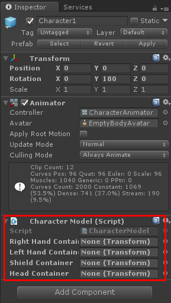
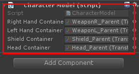
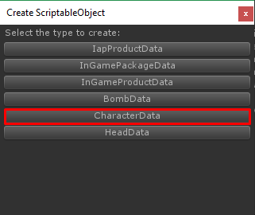
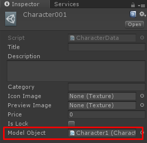
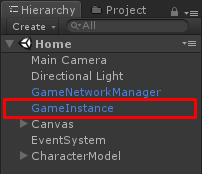
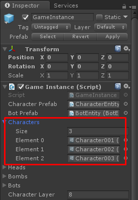

* * *

This is the guide for Battle IO game template which selling at Unity Asset Store ([https://www.assetstore.unity3d.com/#!/content/102515?aid=1100lGeN](https://www.assetstore.unity3d.com/#!/content/102515?aid=1100lGeN))

First, prepare character model. You may create empty scene then drag your character model into the scene to manage it, In your character model add **CharacterModel** component

Then explore into character model children drag game object which you want to instantiate model to each container in **CharacterModel** component

Then make it as a prefab.

Next, you have to create **CharacterData**, right click on anywhere in Project tab choose **Create -> ScriptableObject**

In **Create ScriptableObject** dialog choose **CharacterData**

Then set it name as you wish but it must be unique for example I set it as **Character001**

Then in character data set **Character Model** to character model prefab that you have created

Then open **Home** scene add character data to **GameInstance**

