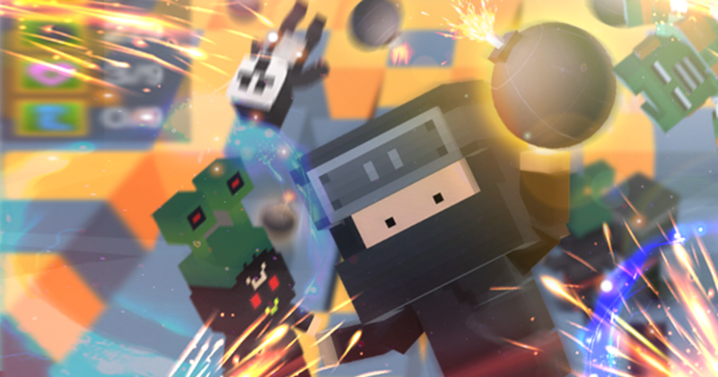

* * *

This is the guide for Battle IO game template which selling at Unity Asset Store ([https://www.assetstore.unity3d.com/#!/content/102515?aid=1100lGeN](https://www.assetstore.unity3d.com/#!/content/102515?aid=1100lGeN))

First, prepare helmet model. You may create empty scene then drag your helmet model into the scene to manage it, Then make it as prefab

Next, you have to create **HeadData**, right click on anywhere in Project tab choose **Create -> ScriptableObject**

In **Create ScriptableObject** dialog choose **HeadData**

Then in head data set **Model Object** to helmet model prefab that you have created

Then open **Home** scene add head data to **GameInstance**

