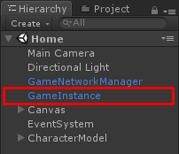

# How to add helmet item

## Prepare Helmet Model

First, prepare helmet model. You may create empty scene then drag your helmet model into the scene to manage it, Then make it as prefab

## Create and set Head Data

Next, you have to create **HeadData**, right click on anywhere in Project tab choose **Create -> ScriptableObject**

In **Create ScriptableObject** dialog choose **HeadData**

Then in head data set **Model Object** to helmet model prefab that you have created

## Add created Head Data to Game Instance

Then open **Home** scene add head data to **GameInstance**

