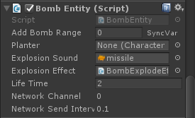
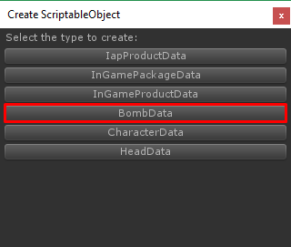
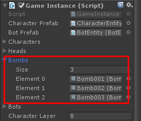

# How to add bomb item

## Prepare Bomb Model

First, prepare bomb entity. You may create empty scene then drag your bomb model into the scene to manage them, In the bomb model add **Bomb Entity** component

In the bomb entity you can set

*   **Explosion Sound** it is the sound which will play when bomb explode
*   **Explosion Effect** it is the fire effect which will play each cells its size should be fit to the cell (x=1, y=1 z=1), you can use particle system to make it as fire effect and you have to attach **EffectEntity** component to the particles you have created
*   **Life Time** it is delay before it explode

After finished setup then make them as prefab you will use it to set in **BombData**

## Create and set Bomb Data

Next, you have to create **BombData**, right click on anywhere in Project tab choose **Create -> ScriptableObject**

In **Create ScriptableObject** dialog choose **BombData**

Then in bomb data set bomb entity prefabs that you have created

## Add created Bomb Data to Game Instance

Then open **Home** scene add bomb data to **GameInstance**

