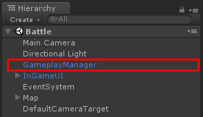

# Gameplay Manager configuration

In **Battle** scene you will see **GameplayManager** game object

You can set gameplay configuration here, There are following configs

*   **Min Move Speed** is min move speed for all characters
*   **Add Move Speed Per Power Up** is amount of move speed which will increasing when collects move speed power up
*   **Max Bomb Range Power Up** is max amount of bomb range power up that character can collects
*   **Max Bomb Amount Power Up** is max amount of bomb amount power up that character can collects
*   **Max Heart Power Up** is max amount of heart power up that character can collects
*   **Max Move Speed Power Up** is max amount of move speed power up that character can collects
*   **Kill Score** is amount of score which will receives when killing another character with bombs
*   **Suicide Score** is amount of score which will receives when killing self with bombs
*   **Bot Count** amount of bots that will fills in the game
*   **Watch Ads Respawn Available** is available amount to let player to watch Ads to respawn without reset stats
*   **Brick Respawn Duration** duration to respawn brick after exploded
*   **Respawn Duration** duration to let players respawn after death
*   **Character Spawn Positions** is list of an transform that their position will be used as spawn position
*   **Power Ups** is an **Power Up Entity** prefab with random weights