* * *

This is the guide for Battle IO game template which selling at Unity Asset Store ([https://www.assetstore.unity3d.com/#!/content/102515?aid=1100lGeN](https://www.assetstore.unity3d.com/#!/content/102515?aid=1100lGeN))

This is example to dedicate server via [Digital Ocean](https://m.do.co/c/03d10d801aee)

First, Create a droplet

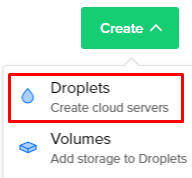

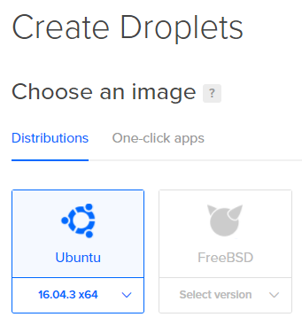

Then setup config for the droplet as you wish then press Create

After finish remember the IP we’ll use it later

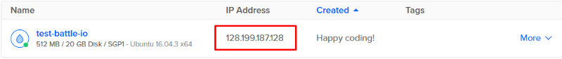

Before you build the server, you might like to set the network port, you can set it in **Home** scene -> **GameNetworkManager** component -> **Network Port**variable

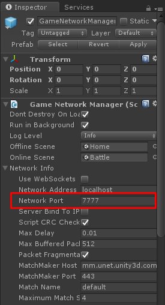

In this example will use Ubuntu x64, so we’re going to build it as Linux in the **Build Settings**

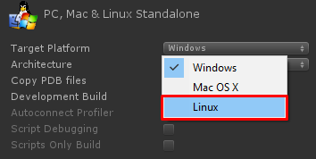

Then select the **Architecture** to **x86\_64** because this going to run on **Ubuntu x64** and set **Headless Mode** to true

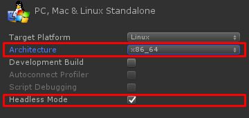

Then build it, after that we will uploads it to the server

Before that, we have to access to the server once to setup password

I use **Putty**([http://www.putty.org/](http://www.putty.org/))  to do that

So open **Putty**, copy your server IP to **Host Name(or IP Address)** input field you may save these settings by enter **Saved Sessions** then press **Save** button. if you are ready, press **Open**

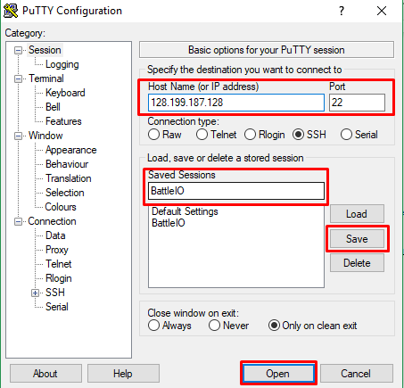

Then **login as: root**, it will asks for your password, you can find it in your email that you’ve use it for register Digital Ocean, copy it then right click in Putty to paste

Then it will request you to enter password again to create new password, so right click to do that then enter new password

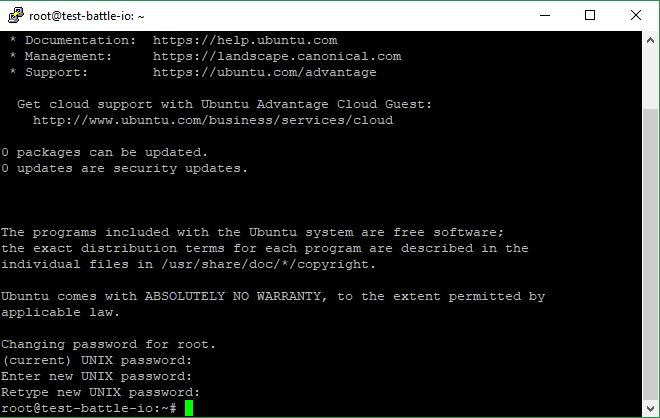

Then upload built server, I will use **FileZilla Client**([https://filezilla-project.org/download.php](https://filezilla-project.org/download.php)) to do that

Open **FileZilla Client** go to menu **File -> Site Manager…** then press **New Site** button then enter its name, host, user and password, set protocol to **SFTP** then press **Connect** button

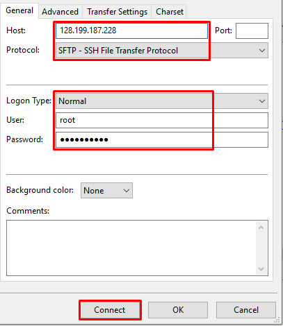

After connected access to place where you built the server from local site section then upload all files by right click selected files and press **Upload**

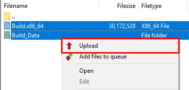

After uploaded right click on your build file at remote site section then select **File permissions…**

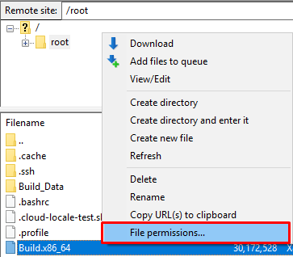

Then set **Numeric value** to 755

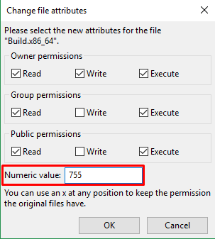

Then go back to Putty go to root folder with command

cd ~

Then run the build with command

./Build.x86\_64

Then go back to your project (Unity) open **Home** scene at **Canvas** game object -> **UI Main Menu** component set **Online Network Address** to your IP and **Online Network Port** to your server port for this example it is 7777

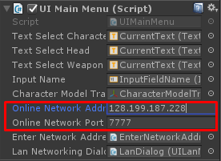

Then run it to test, press Online button

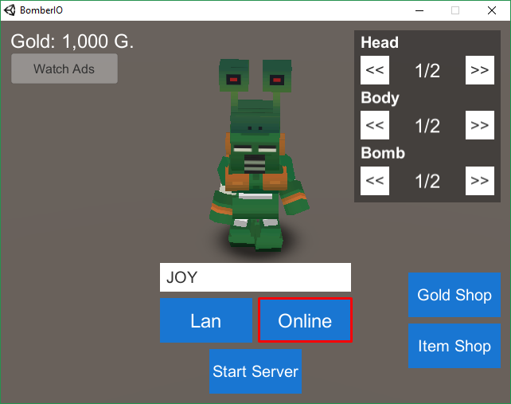